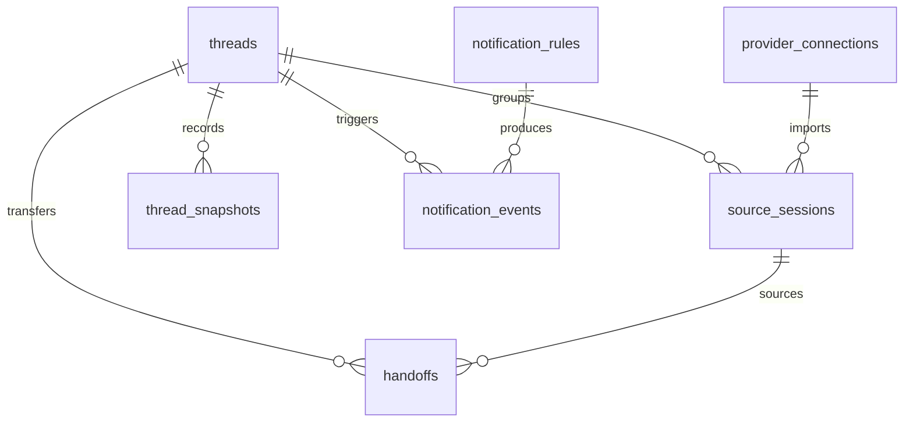

# ThreadKeeper MVP ERD

## 1. Design Goal

The MVP data model should preserve continuity across AI work sessions without depending on one provider's native format.

The core unit is a `thread`, not a provider session.

## 2. Main Tables

### `threads`

- `id` bigint PK
- `project_key` varchar(100)
- `title` varchar(200)
- `status` varchar(20)
- `priority` varchar(20)
- `original_intent` text
- `today_goal` text
- `done_condition` text
- `current_next_action` text
- `drift_status` varchar(20)
- `last_activity_at` timestamptz
- `completed_at` timestamptz null
- `created_at` timestamptz
- `updated_at` timestamptz

### `provider_connections`

- `id` bigint PK
- `provider` varchar(30)
- `account_label` varchar(100)
- `home_path` varchar(300)
- `status` varchar(20)
- `last_import_at` timestamptz null
- `last_error_message` text null
- `created_at` timestamptz
- `updated_at` timestamptz

### `source_sessions`

- `id` bigint PK
- `thread_id` bigint FK
- `provider_connection_id` bigint FK
- `provider_session_key` varchar(200)
- `provider` varchar(30)
- `source_path` varchar(500)
- `source_type` varchar(50)
- `title` varchar(200) null
- `started_at` timestamptz null
- `last_activity_at` timestamptz null
- `imported_at` timestamptz
- `metadata_json` jsonb

### `thread_snapshots`

- `id` bigint PK
- `thread_id` bigint FK
- `snapshot_type` varchar(30)
- `summary` text
- `next_action` text
- `blockers` text
- `drift_score` numeric(5,2) null
- `drift_status` varchar(20) null
- `created_at` timestamptz

### `handoffs`

- `id` bigint PK
- `thread_id` bigint FK
- `source_session_id` bigint FK null
- `target_provider` varchar(30)
- `reason` varchar(100)
- `what_changed` text
- `blockers` text
- `next_action` text
- `files_note` text
- `status` varchar(20)
- `created_at` timestamptz

### `notification_rules`

- `id` bigint PK
- `rule_type` varchar(30)
- `enabled` boolean
- `channel` varchar(30)
- `threshold_minutes` int null
- `scheduled_time` varchar(10) null
- `config_json` jsonb
- `created_at` timestamptz
- `updated_at` timestamptz

### `notification_events`

- `id` bigint PK
- `thread_id` bigint FK null
- `rule_id` bigint FK null
- `event_type` varchar(30)
- `channel` varchar(30)
- `payload_json` jsonb
- `delivery_status` varchar(20)
- `sent_at` timestamptz null
- `created_at` timestamptz

## 3. Enums

### `thread.status`

- `ACTIVE`
- `PAUSED`
- `BLOCKED`
- `COMPLETED`

### `thread.priority`

- `LOW`
- `MEDIUM`
- `HIGH`

### `thread.drift_status`

- `ON_TRACK`
- `DRIFTING`
- `BLOCKED`
- `COMPLETED`

### `thread_snapshots.snapshot_type`

- `INITIAL_INTENT`
- `PROGRESS`
- `DAILY_BRIEF`
- `COMPLETION`

### `handoffs.status`

- `DRAFT`
- `READY`
- `USED`

### `notification_rules.rule_type`

- `INACTIVITY`
- `COMPLETION`
- `DAILY_BRIEFING`
- `DRIFT_ALERT`

### `notification_events.delivery_status`

- `QUEUED`
- `SENT`
- `FAILED`

## 4. Relationship Summary

- One thread can link to many provider-native source sessions
- One thread can have many snapshots over time
- One thread can have many handoffs
- One provider connection can import many source sessions
- One rule can produce many notification events

## 5. Mermaid ER Diagram

## 6. Index Suggestions

- `threads(status, priority, last_activity_at)`
- `threads(project_key, updated_at)`
- `source_sessions(thread_id, imported_at)`
- `source_sessions(provider, provider_session_key)`
- `thread_snapshots(thread_id, created_at)`
- `handoffs(thread_id, created_at)`
- `notification_events(delivery_status, created_at)`
